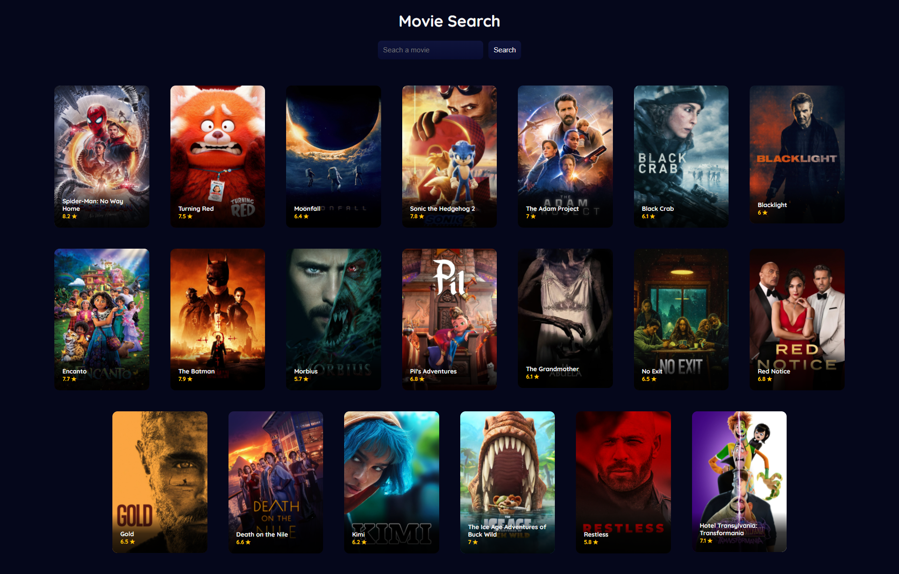

# Movie Search app with React

#### Table of Contents

-   [The Project](#project)
    -   [Built With](#built-with)
    -   [Features](#features)
    -   [Clone project](#clone-the-project)
-   [Deploy](#deploy)
-   [Contact](#contact)

---

## Project



### Built With

-   [React](https://reactjs.org/)
-   Bootstrapped with [Create React App](https://github.com/facebook/create-react-app).
-   [The Movie DB API](https://www.themoviedb.org)

### Features

This app was created following a [Scrimba](https://scrimba.com) course. <br>

##### Functionnalities from the course:

-   Search bar, fetching movies with their informations
-   Basic of components separation, movie & query states

##### Functionnalities added:

-   Default: fetches popular movies
-   Error message when empty search query
-   Showing only preview of the movie, and a full card with more infos when clicked.
-   Design
-   TODO: When fetching, reduce images sizes. Right now images are heavy, and the site isn't optimised for slower connections. Could use [this package](https://www.npmjs.com/package/react-image-file-resizer).

### Clone the project

To clone and run this application, you'll need [Git](https://git-scm.com) and [Node.js](https://nodejs.org/en/download/) (which comes with [npm](http://npmjs.com)) installed on your computer. From your command line:

```bash
# Clone this repository
$ git clone https://github.com/Tanya-Amber-L/React-Movie-Search.git

# Install dependencies
$ npm install

# Run the app
$ npm run start
```

## Deploy

[ToDo]()

## Contact

-   [Website: tleenders.be](https://tleenders.be)
-   [GitHub: Tanya-Amber-L](https://github.com/Tanya-Amber-L)
